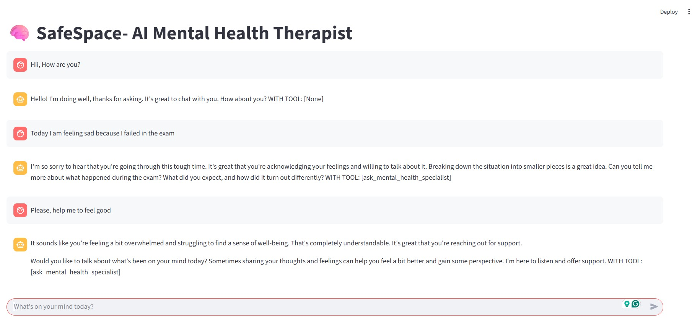
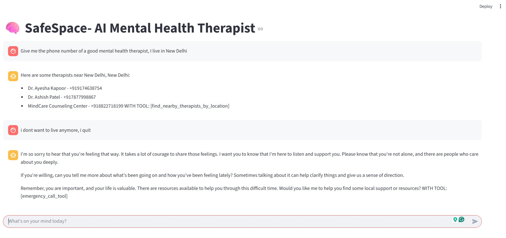

# 🛡️ SafeSpace – AI Mental Health Therapist

**Your compassionate AI companion for emotional support, built with care and real-world tools.**  
SafeSpace listens, understands, and responds with empathy — and knows when to escalate to emergency help.

---

## 💡 Overview
SafeSpace is an AI-powered mental health assistant that:
- Provides **normal chat** using [Groq](https://groq.com/) with `llama3-70b-8192` for general conversations.
- Switches to **MedGemma** healthcare model when signs of sadness, distress, or mental therapy needs are detected.
- Uses **Twilio** for **emergency calls** to life-saving services if required.
- Built with **AI Agent architecture** to handle multiple specialized AI models and tools.

---

## ✨ Features
- 🧠 **Dual AI Modes**
  - **General mode:** LLaMA3-70B (Groq free API)
  - **Therapy mode:** MedGemma for healthcare-focused responses
- 📞 **Emergency Support** via Twilio API
- 🗣️ Context-aware conversation switching
- ⚙️ Modular backend for easy extension
- 🖼️ UI for seamless user experience

---

## 🛠 Tech Stack
- **Backend:** Python, FastAPI
- **AI Models:** Groq (LLaMA3-70B), MedGemma
- **Emergency Call:** Twilio API
- **Frontend:** Python-based UI (extendable to web or mobile)
- **Package Management:** uv / pip
- **Version Control:** Git & GitHub

---

## 📂 Project Structure
SAFESPACE-AI-AGENT
│ .gitignore
│ .python-version
│ pyproject.toml
│ README.md
│ uv.lock
│
├── assets
│ ├── 1.jpg
│ └── 2.jpg
│
├── frontend.py
├── main.py
│
│
├── backend
│ ├── pycache/
│ ├── ai_agent.py
│ ├── config.py
│ ├── main.py
│ ├── tools.py
│ 
└── .venv/

🖼 Screenshots




⚠️ Disclaimer
SafeSpace is not a substitute for professional therapy.
If you are experiencing a crisis, please reach out to a licensed professional or emergency services immediately.
---

## 🚀 Installation & Setup

1. **Clone the repository**
```bash
git clone https://github.com/raghavsharma1603/SafeSpace-AI-Agent.git
cd SafeSpace-AI-Agent
---
